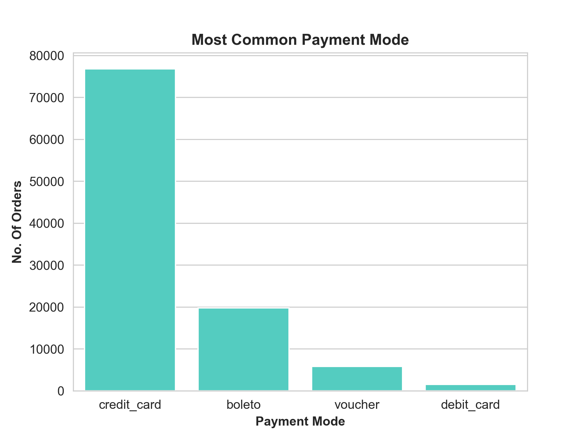
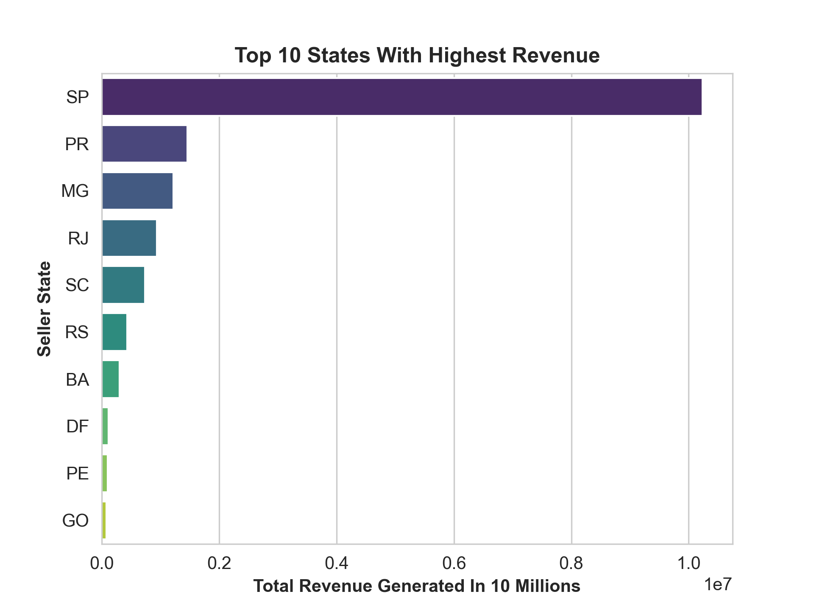
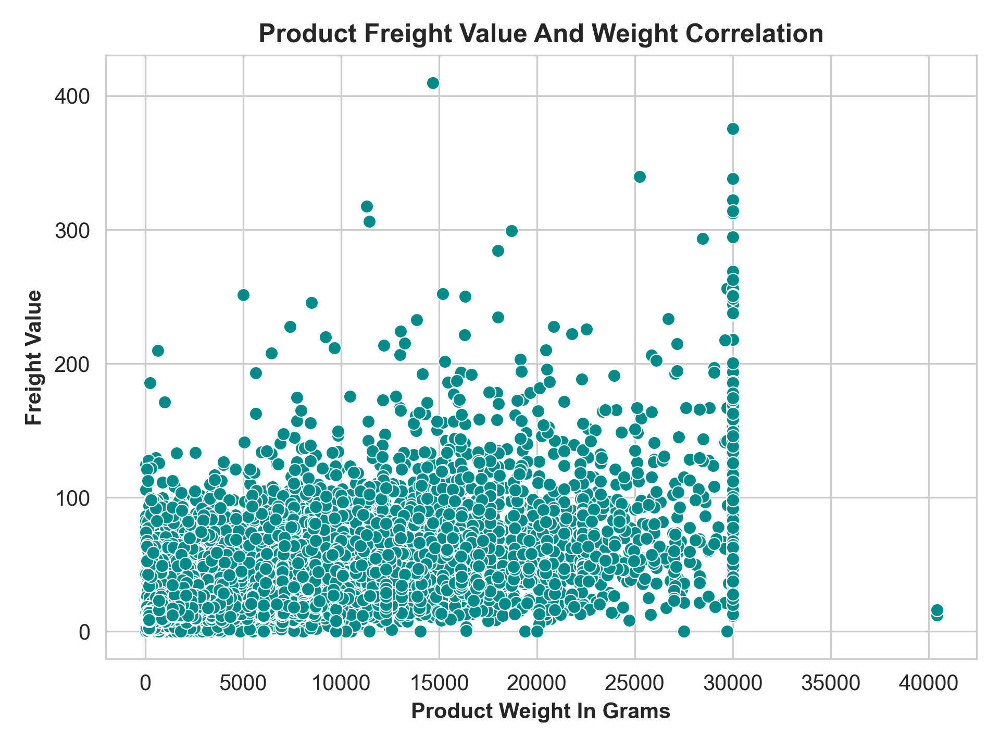

# E-Commerce-Business-Analytics

End-to-end e-commerce business analytics project using Python, SQL, Power BI, and Excel to generate actionable business insights from multi-table data.

Aim of this project is to discover business insights from 8 inter-connected E-Commerce csv files by performing data cleaning, exploratory data analysis (EDA), SQL-based business queries, and making Interactive dashboards using Microsoft Power BI.

---

# Project Overview

This Project aims to answer the following questions using EDA ,Dashboards and SQL querries :

- Which states and cities generated the highest revenue and consumed the highest number of goods ?
- Which product categories generated highest revenue and produces highest no. of goods ?
- Which payment mode is used for most orders and generated highest revenue ?
- Most common reason for orders not getting delivered ?
- Which year generated highest revenue and got highest number of orders ?
- Which cities have highest delays in order delivery ?
- Which product categories have highest delays ?
- Which time of the day and month of the year generates highest no. of orders and revenue ?
- Which Product Categories have highest average review ?
- Which seller cities and states have highest average review ?
- How average review changes over undelivered goods ?
- What are most common intallments plans ?

---

# Tech Stack

- Python
- Pandas
- Matplotlib
- Seaborn
- SQL
- Power BI

---

# Analysis Performed

## Data Assessment 

- Data Inspection
- Data type inspection
- Finding null values
- Finding duplicate values

---

## Customer Analysis

- Cities with highest number of orders
- States with highest number of orders
- Cities with orders not yet delivered
- States with orders not yet delivered

---

## Product Analysis

- Most ordered product categories
- Relation between product weight and freight price

---

## Seller Analysis

- Cities that sold highest number of goods
- States that sold highest number of goods
- Cities that have generates highest revenue
- States that have generates highest revenue

---

## Payment Analysis

- Most common payment type
- Most common installment plans
- Payment sequentials

---

## Review Analysis

- Highest average review among seller cities
- Highest average review among seller states
- Highest average review among product categories

---

## MySQL Analysis 

- Months with highest number of orders
- Years with highest number of orders
- Customer city with highest dilevery delays
- Customer city with highest difference in purchase date and delivery date  
- Hour of day with highest number of purchases 

---

## Power BI Dashboards

- Executive Overview 
- Customer And Sales Analysis
- Payment Analysis 

---

# Sample Visualisations 

---

## Most Common Payment Mode

---

## Highest Revenue Generating States 

---

## Product Weight And Freight Value Relation

---

# Power BI Dashboards

---

---