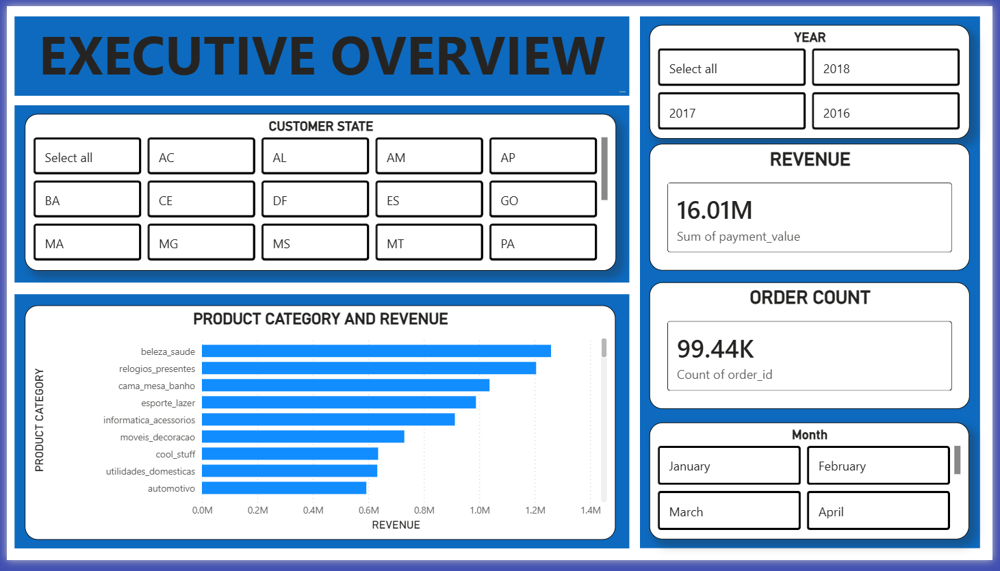
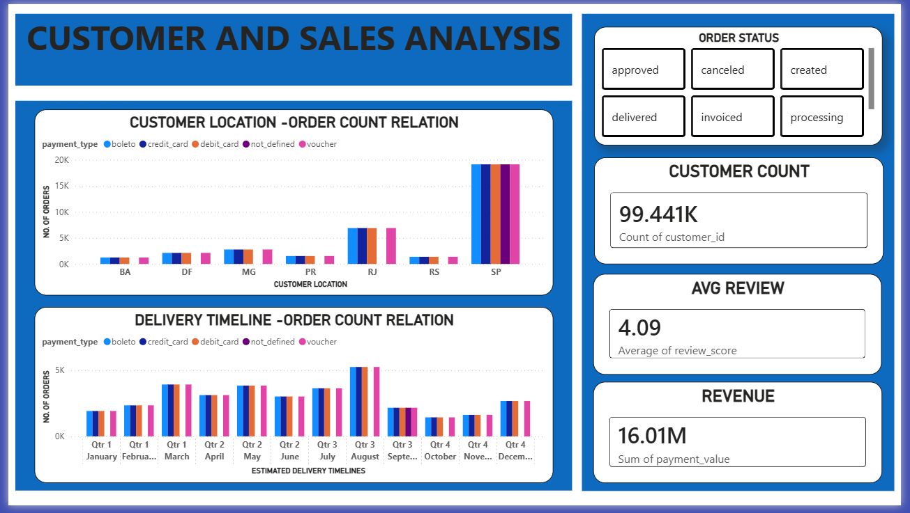
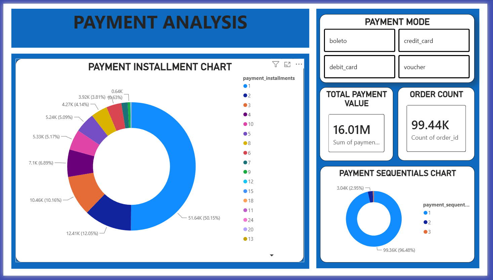

# E-Commerce-Business-Analytics

End-to-end e-commerce business analytics project using Python, SQL, Power BI, and Excel to generate actionable business insights from multi-table data.

Aim of this project is to discover business insights from 8 inter-connected E-Commerce csv files by performing data cleaning, exploratory data analysis (EDA), SQL-based business queries, and making Interactive dashboards using Microsoft Power BI.

---

# Project Overview

This Project aims to answer the following questions using EDA ,Dashboards and SQL querries :

- Which states and cities generated the highest revenue and consumed the highest number of goods ?
- Which product categories generated highest revenue and produces highest no. of goods ?
- Which payment mode is used for most orders and generated highest revenue ?
- Most common reason for orders not getting delivered ?
- Which year generated highest revenue and got highest number of orders ?
- Which cities have highest delays in order delivery ?
- Which product categories have highest delays ?
- Which time of the day and month of the year generates highest no. of orders and revenue ?
- Which Product Categories have highest average review ?
- Which seller cities and states have highest average review ?
- How average review changes over undelivered goods ?
- What are most common intallments plans ?

---

# Tech Stack

- Python
- Pandas
- Matplotlib
- Seaborn
- SQL
- Power BI

---

# Analysis Performed

## Data Assessment 

- Data Inspection
- Data type inspection
- Finding null values
- Finding duplicate values

---

## Customer Analysis

- Cities with highest number of orders
- States with highest number of orders
- Cities with orders not yet delivered
- States with orders not yet delivered

---

## Product Analysis

- Most ordered product categories
- Relation between product weight and freight price

---

## Seller Analysis

- Cities that sold highest number of goods
- States that sold highest number of goods
- Cities that have generates highest revenue
- States that have generates highest revenue

---

## Payment Analysis

- Most common payment type
- Most common installment plans
- Payment sequentials

---

## Review Analysis

- Highest average review among seller cities
- Highest average review among seller states
- Highest average review among product categories

---

## MySQL Analysis 

- Months with highest number of orders
- Years with highest number of orders
- Customer city with highest dilevery delays
- Customer city with highest difference in purchase date and delivery date  
- Hour of day with highest number of purchases 

---

## Power BI Dashboards

- Executive Overview 
- Customer And Sales Analysis
- Payment Analysis 

---

# Major Insights

---

## Revenue Insights 

- Sao Paulo sells highest number of goods and generated highest revenue of more than 3 million followed by intinga and curitiba with revenue more than 500K.

- SP sells most number of goods and generates highest revenue above 10 million followed by PR and MG.

- Health and Beauty Products have highest revenue of 1.2 M followed by watches and gifts and bed bath table.

---

## Customer Cities

- Sao Paul have ordered highest number of goods  followed by Rio De Janerio 

- SP have ordered highest number of products followed by RJ and MG

---

## Seller Insights

- 2018 saw the highest number of orders 58K+ and revenue followed by 2017 and 2016

- Overall August generates highest number of orders and revenue followed by march and may.

---

## Product Related Insights

- Bed-Bath-Table Category generated highest number of orders (10000+ orders) yet it is at 3rd position in terms of revenue.

- Health-Beauty generated second highest number of orders but genersted highest revenue.

- There is an increase in freight value with product weight.

---

## Logistics Related Insights

- Among orders yet not delivered Shipped orders are in highest quantity followed by canceller orders and unavailable items.

- Rio De Janerio have higher number of shipped orders than Sao Paulo despite having lower number of orders overall.

- Jurutil city have highest gap in purchase date and delivery date followed by Alvorado D'Oeste and Portalage.

- Novo Brasil city have highest average delivery delay followed by Capinzal Donorte and Adhemar De Baros.

- Average review for all delivered goods is 4.16.

- 2963 customers have undelivered orders while they have already paid 586K resulting in average review od 1.75 for all such orders.

---

## Time Based Insights

- Most Common order time during day is 4PM,11AM,2PM and 1PM.

- 2018 generated highest revenue of 8.86 million followed by 2017 with 6.51 million.

- Quater-3 of Year generated highest orders and revenue followed by Quater 1.

---

## Payment Related Insights

- Credit Card is most used payment mode with 76000+ orders with 12.54 million revenue payment value and followed by Boleto,Vouchers and debit card.

- Boleto,debit card and vouchers have only 1 time payments while credit card users take installment plans.

---

## Review Score Related Insights

- Health Beauty,Sports leisure and auto have highest average review scores.

- Curtiba, Belo Horizonte and Santo Andre as seller cities have highest average review scores.

- GO,RS and PE as seller states have highest average review score.

---

# Sample Visualisations 

---

## Most Common Payment Mode

---

## Highest Revenue Generating States 

---

## Product Weight And Freight Value Relation

---

# Power BI Dashboards

---

---